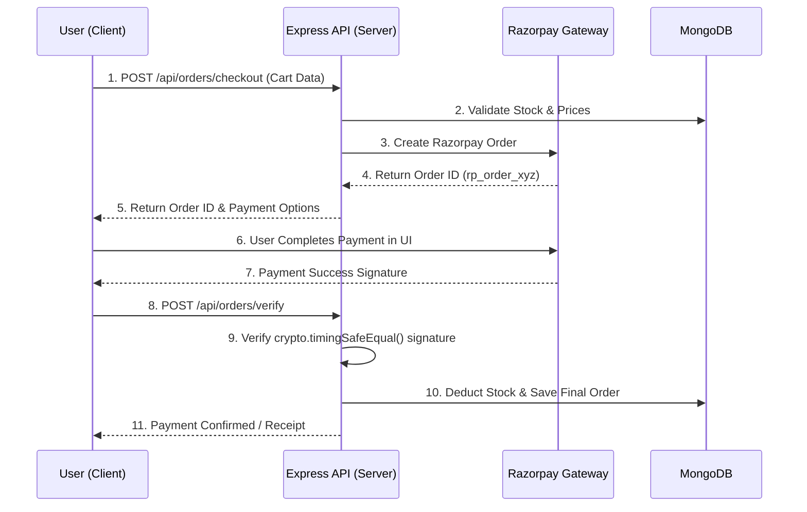

   
  

    <b>High-Performance MERN E-Commerce Platform</b>
  

  

    
    
    
    
    
    
  

---

**MensVibe** is a modern, production-ready e-commerce ecosystem built for scale. Specializing in premium men's apparel and footwear, it leverages a high-performance **MERN** stack architecture combined with a sleek, glassmorphic UI to deliver an unparalleled shopping experience. 

Designed for both consumers and vendors, MensVibe features a powerful multi-role administrative core, dynamic multi-vendor storefronts, and robust financial ledger tracking.

---

## 🏗️ System Architecture

Our platform is engineered for scalability, separating concerns cleanly across the frontend, backend API, and database layers.

### 🔄 Order & Payment Implementation Workflow
Here is an inside look at how secure transactions are processed through the Razorpay SDK and our MongoDB schemas:

---

## ✨ Core Pillars

### 🛍️ Premium Storefront Experience
- **Fluid UX**: Modern UI with subtle neon accents (`#c1ff00`), Framer Motion micro-interactions, and a bespoke dark mode aesthetic (`#121212`).
- **Intelligent Catalog**: High-performance multi-facet filtering (category, size, color, price range).
- **Seamless Checkout**: Frictionless shopping cart securely integrated with **Razorpay**.

### 🔐 Hardened Security Architecture
- **Strict RBAC**: Role-Based Access Control enforcing granular permissions for Customers, Sellers (Vendors), and Admins.
- **Cryptographic Integrity**: Secure password generation, robust JWT session management, and `crypto.timingSafeEqual` signature verification.
- **Bulletproof APIs**: Zod schema-validated payloads and sanitized NoSQL execution paths.

### 📊 Seller Command Center
- **Multi-seller Ecosystem**: sellers manage their own storefronts (`/store/:brandName`) and curate catalogs.
- **Real-Time Logistics**: Sellers access dedicated dashboards to monitor incoming orders and track inventory depth.
- **Financial Ledger**: Automated tracking of seller revenues minus the platform commission fee.

---

## 🛠️ Technology Stack

| Layer | Technologies |
| :--- | :--- |
| **Frontend** | React 19, Vite, Tailwind CSS v4, Framer Motion, Lucide Icons |
| **Backend** | Node.js (>= 18), Express |
| **Database** | MongoDB (Atlas), Mongoose ODM (Advanced Aggregations & Indexing) |
| **Validation** | Zod (Schema Validation), Express-Validator |
| **Payments** | Razorpay Node.js SDK |
| **Testing** | Vitest, Supertest |

---

## ⚖️ License
Distributed under the MIT License. See `LICENSE` for more information.

   
  <i>Built with passion for the modern web.</i>

