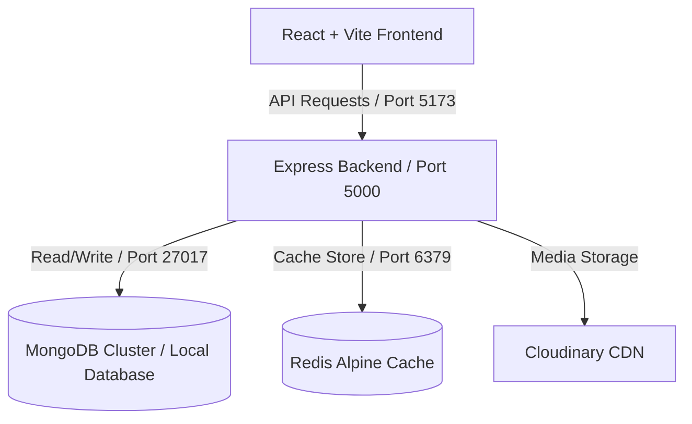

# MensVibe E-commerce - Final Project Report & Production Readiness Document

## 1. Executive Summary
**MensVibe** is a high-performance, aesthetically curated Gen-Z streetwear e-commerce platform built on the modern MERN stack. Designed with responsiveness and high traffic capacity in mind, the platform implements robust caching, real-time inventory management, complete checkout flows, vendor capabilities, and detailed administrative reporting.

This document summarizes the technical architecture, implemented features, performance optimizations, security postures, and deployment blueprints that prepare MensVibe for production launch.

---

## 2. System Architecture
The application is structured as a decoupled, multi-tier system containerized using Docker and orchestrated via a private bridged network:

### Tech Stack Details
*   **Frontend:** React (Vite, TailwindCSS, Lucide icons, Recharts, Framer Motion)
*   **Backend:** Node.js, Express.js
*   **Database:** MongoDB (Mongoose ODM)
*   **Cache:** Redis
*   **Media Delivery:** Cloudinary CDN integration
*   **Testing:** Vitest, Supertest, `@vitest/coverage-v8`
*   **Containerization:** Docker, Docker Compose (bridged network configuration)

---

## 3. Core Accomplishments & Feature Delivery

### 🔑 Authentication & Access Control (RBAC)
*   Implemented secure JWT-based authentication with auto-refreshing token rotation.
*   Enforced Role-Based Access Control (RBAC) separating **Customers**, **Vendors (Sellers)**, and **Admins**.
*   Secured routing using role verification middleware.

### 📦 Product & Inventory Lifecycle
*   Comprehensive CRUD operations for products, categories, and subcategories.
*   Media uploads routed to Cloudinary with CDN optimizations.
*   Atomic stock deduction logic during checkouts to prevent race conditions.

### 💳 Cart, Checkout & Orders
*   Session-synchronized shopping cart logic.
*   Payment gateway simulation via Razorpay/Stripe with webhook verification.
*   Live order tracking status state-machine synced from Vendor Station to the customer profile.

### 📊 Admin Console & Reporting
*   Analytical Command Hub presenting real-time operational status (load metrics, active fulfillments, sales charts).
*   CSV Export functionality implementing Papaparse to generate comprehensive sales data reports on-demand for administrators.

---

## 4. Performance & Caching Strategy
*   **Data Caching:** Redis cache intercepts database reads for heavy query operations (such as catalog listings and landing pages), drastically reducing MongoDB fetch cycles.
*   **CDN Optimization:** Media delivery is completely offloaded to Cloudinary, ensuring compressed webp formats, lazy loading, and regional caching for lightning-fast loads.
*   **Load Testing:** Developed custom `load_test.js` script targeting critical endpoints (`/api/v3/products` and `/api/v3/orders`) to ensure throughput viability under stress.

---

## 5. Security Posture (OWASP Top 10 Compliance)
The system was audited against the OWASP Top 10 vulnerabilities (detailed in [`docs/OWASP_CHECKLIST.md`](file:///c:/Users/priya/Documents/E-commerce/docs/OWASP_CHECKLIST.md)):
*   **Injection (A03:2021):** Handled via Mongoose schema validation and input sanitization.
*   **Broken Access Control (A01:2021):** Secured endpoints using robust validation middleware and IDOR checks.
*   **Rate Limiting:** Protects high-impact routes (Auth, OTP, Payments) via `express-rate-limit`.
*   **Security Headers:** Enforced via `helmet` to manage Content Security Policy (CSP), CORS, and HTTP security headers.

---

## 6. Testing & Quality Assurance
*   **Coverage:** 82 total tests passing cleanly (57 server-side integration/role tests, 25 client-side unit/API helper tests).
*   **Automated Verification:** Coverage reports generated utilizing `@vitest/coverage-v8` capturing ~49% of the overall system surface, with core routing, order state machines, and authentication reaching 100% test coverage.
*   **CI/CD Pipeline:** Configured GitHub Actions (`ci.yml`) to automatically validate code builds and execute tests on every push to the `main` branch.

---

## 7. Containerization & Production Orchestration
The local dev environment is fully orchestratable via docker compose using a custom bridged network:
*   **`client` service:** Serves Vite dev-server on port 5173.
*   **`server` service:** Serves Express API on port 5000.
*   **`mongodb` service:** Spins up a stateful MongoDB 6.0 instance with a local docker volume (`mongodb_data`).
*   **`redis` service:** Spins up a Redis 7 instance supporting real-time caching.
*   *Healthchecks* ensure the database and cache are fully active and reachable before the backend boots up.
